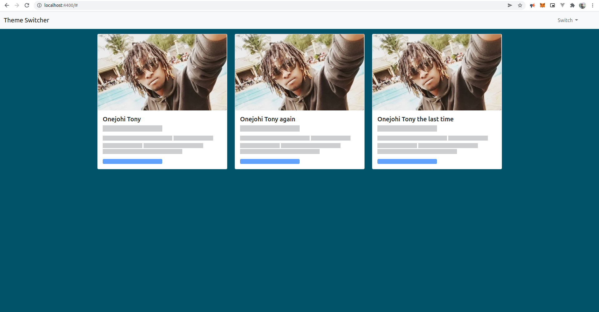
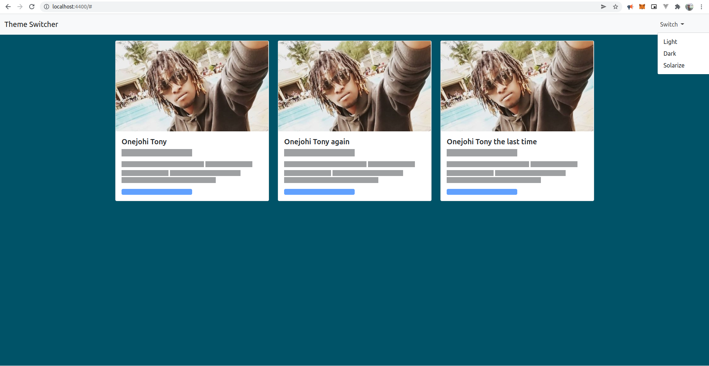
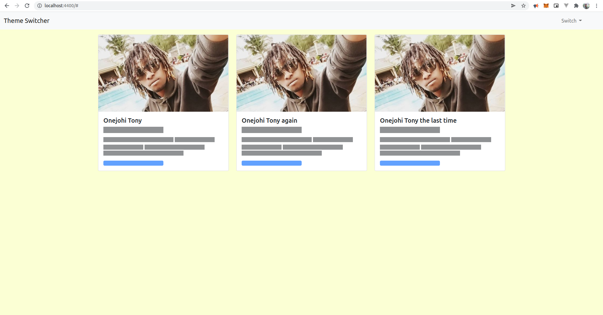

# Theme Switcher

This is a simple website built using VanillaJS that switches the background
color and theme using a dropdown menu.
The options are:
- Light theme
- Dark theme
- Solarized

Feel free to add any other themes you wish.

### Launch the app.

To launch the app, clone the project into your local repository.
Ensure you have mock server you can use to host your app locally, no modules are required...

I recommend using `http-server`.
Install http-server globally on your machine (requires you to have installed [NodeJS](https://nodejs.org/en/) first).
Use the command `npm i --g http-server` or `npm install --global http-server` to install http-server globally, then `cd` into the repo
you just cloned and run the app using `http-server`. If port 8080 is available, the app will run on this port. Otherwise it will go to the next one
`8081` until it finds an available port, to specify a port, run `http-server -p 4400` to run the app on port 4400.

### Screenshots

> The dropdown to use when selecting a theme is on the far right.

> Solarized light theme...